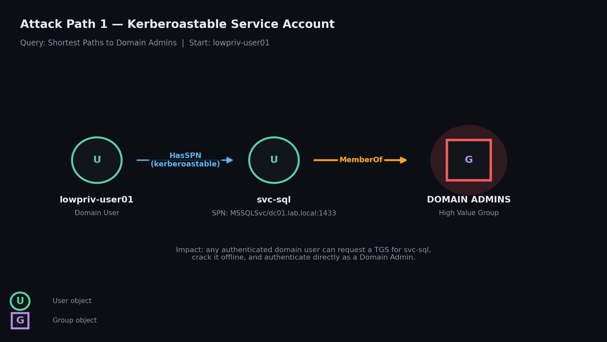
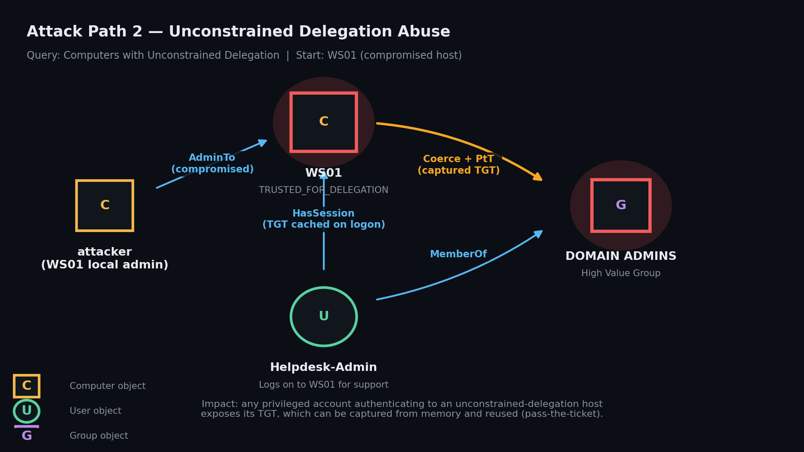
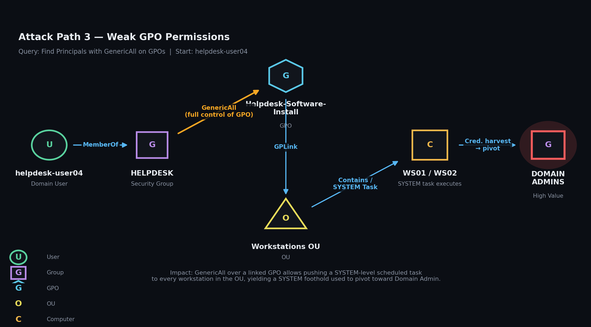
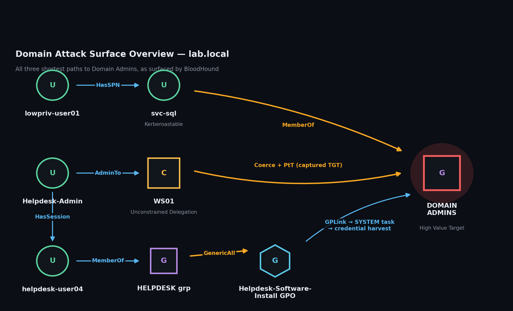

# Vulnerable Active Directory Home Lab


Code and documentation for a deliberately vulnerable
Active Directory environment, built for hands-on study of common AD
misconfigurations, BloodHound attack-path mapping, and Kerberos/GPO
abuse techniques.

This repo captures the exact steps I used to build the lab described in
[`docs/WRITEUP.md`](docs/WRITEUP.md): one domain controller, two
workstations, and three intentionally introduced misconfigurations
that each lead to Domain Admin.

> **Intended for isolated, offline lab use only.** Every script in this repo
> disables security controls on purpose. Please do NOT run any of this
> against a domain joined to a live network, or
> any system you do not own. See [`DISCLAIMER.md`](DISCLAIMER.md).

## Attack paths at a glance

Three independent misconfigurations, three shortest paths to Domain Admins
mapped in BloodHound and confirmed by manual exploitation. Full diagrams in
[`docs/assets/`](docs/assets/).

<table>
<tr>
<td width="33%" align="center">
<br/>
<sub><b>1. Kerberoastable service account</b><br/>HasSPN → MemberOf → Domain Admins</sub>
</td>
<td width="33%" align="center">
<br/>
<sub><b>2. Unconstrained delegation</b><br/>AdminTo → HasSession → captured TGT</sub>
</td>
<td width="33%" align="center">
<br/>
<sub><b>3. Weak GPO permissions</b><br/>GenericAll → GPLink → SYSTEM task</sub>
</td>
</tr>
</table>

<p align="center">
<br/>
<sub>All three shortest paths to Domain Admins, as surfaced by BloodHound's built-in query.</sub>
</p>

## Repo layout

```
vulnerable-ad-homelab/
├── README.md
├── DISCLAIMER.md
├── LICENSE
├── scripts/
│   ├── 00-Variables.ps1                  # shared config used by every script
│   ├── 01-Install-ADDS.ps1               # promote Windows Server 2019 to a DC
│   ├── 02-New-OUStructure.ps1            # create Users / Computers / ServiceAccounts OUs
│   ├── 03-New-LabUsersAndGroups.ps1      # populate the domain with sample users/groups
│   ├── 04-Introduce-Kerberoasting.ps1    # misconfig #1: SPN'd, over-privileged svc account
│   ├── 05-Enable-UnconstrainedDelegation.ps1  # misconfig #2: unconstrained delegation on WS01
│   ├── 06-Configure-WeakGPO.ps1          # misconfig #3: GenericAll on a GPO for a low-priv group
│   ├── 07-Snapshot-Checklist.ps1         # prints the VirtualBox snapshot checklist
│   └── 99-Reset-Lab.ps1                  # rolls back all three misconfigurations
├── bloodhound/
│   └── Invoke-Collection.ps1             # wraps SharpHound.exe with the flags used in this lab
└── docs/
    ├── WRITEUP.md                        # link back to the full write-up
    ├── BUILD-GUIDE.md                    # step-by-step lab build instructions
    ├── ATTACK-PATHS.md                   # documented exploitation commands per path
    └── assets/                           # BloodHound-style attack path diagrams (above)
```

## Quick start

1. Stand up Windows Server 2019 + two Windows 10 VMs + Kali Linux in VirtualBox on an
   isolated, host-only network (see [`docs/BUILD-GUIDE.md`](docs/BUILD-GUIDE.md)).
2. On the domain controller, run the scripts in `scripts/` **in numeric order**, `01` through `06`.
3. From a domain-joined but non-privileged host, run `bloodhound/Invoke-Collection.ps1`
   to collect and zip the SharpHound data, then load it into the BloodHound GUI.
4. Follow [`docs/ATTACK-PATHS.md`](docs/ATTACK-PATHS.md) to exploit each of the
   three paths manually from the Kali attack host.
5. Run `scripts/99-Reset-Lab.ps1` to revert the misconfigurations, or restore your
   VirtualBox `00-baseline` snapshot to start over.

## Requirements

- VirtualBox 7.x
- Windows Server 2019 (evaluation media is fine for a lab)
- 2x Windows 10 (any recent build)
- Kali Linux (current release)
- [BloodHound](https://github.com/SpecterOps/BloodHound) + SharpHound collector
- [Impacket](https://github.com/fortra/impacket) on the Kali host
- [Rubeus](https://github.com/GhostPack/Rubeus) and [Mimikatz](https://github.com/gentilkiwi/mimikatz) - build or
  download from their official repos
- [SharpGPOAbuse](https://github.com/FSecureLABS/SharpGPOAbuse) — same, official repo only
